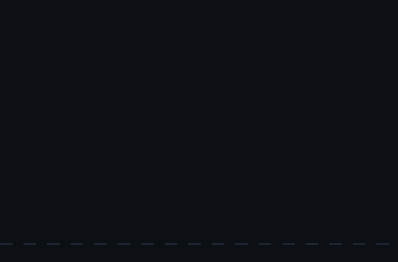

`ATTENTIONX LABS`

 

---

<table>
<tr>
<td valign="top" width="58%">

I got into AI because it looked like magic. Turned out to be math, and I stayed anyway.

Most weeks I'm reading a paper I only half understand, then trying to build a small version of it before the hype moves on. I don't have a single niche — if it's new and it learns something, I'm probably already messing with it.

`python` · `pytorch` · `c` · `c++` · `typescript`
`fastapi` · `next.js` · `docker` · `supabase`

**Currently poking at**

- agent stacks that keep a plan instead of guessing
- putting a model somewhere it's actually useful
- whatever dropped this week

</td>
<td valign="top" width="42%">

</td>
</tr>
</table>

---

### ◈ &nbsp;Stack&nbsp; ◈

 

---

### ◈ &nbsp;Stuff I've Built&nbsp; ◈

| | Project | |
|:--|:--|:--|
| `01` | **[singularity-1](https://github.com/dinu2oo6/singularity-1)** · `TypeScript` | agent stack — reasoning, memory, tools |
| `02` | **[campusruleai](https://github.com/dinu2oo6/campusruleai)** · `Python` | an LLM that actually knows the rulebook |
| `03` | **[skin-disease-analysis](https://github.com/dinu2oo6/skin-disease-analysis)** · `Python` | deep learning on dermatological images |
| `04` | **[cafemanager](https://github.com/dinu2oo6/cafemanager)** · `Swift` | native iOS, no model involved, still fun |

---

### ◈ &nbsp;Contribution Snake&nbsp; ◈

<picture>
  <source media="(prefers-color-scheme: dark)" srcset="https://raw.githubusercontent.com/dinu2oo6/dinu2oo6/output/github-contribution-grid-snake-dark.svg">
  <source media="(prefers-color-scheme: light)" srcset="https://raw.githubusercontent.com/dinu2oo6/dinu2oo6/output/github-contribution-grid-snake.svg">
  
</picture>

<i>generated with <a href="https://github.com/Platane/snk">Platane/snk</a></i>

---

### ◈ &nbsp;Numbers&nbsp; ◈

 

  

---

no roadmap, just curiosity. say hi if you're building something weird.

  

