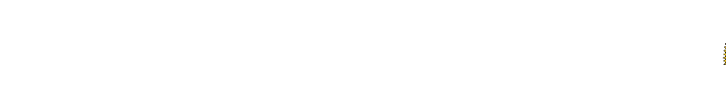
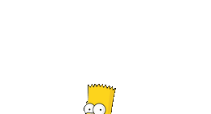

`ATTENTIONX LABS`

 

`●` `●` `●` &nbsp;&nbsp; dinesh@attentionx — zsh

 

<picture>
  <source media="(prefers-color-scheme: dark)" srcset="https://raw.githubusercontent.com/dinu2oo6/dinu2oo6/output/github-contribution-grid-snake-dark.svg">
  <source media="(prefers-color-scheme: light)" srcset="https://raw.githubusercontent.com/dinu2oo6/dinu2oo6/output/github-contribution-grid-snake.svg">
  
</picture>

<i>generated with <a href="https://github.com/Platane/snk">Platane/snk</a></i>

 

**no roadmap, just curiosity.**

say hi if you're building something weird.

 

